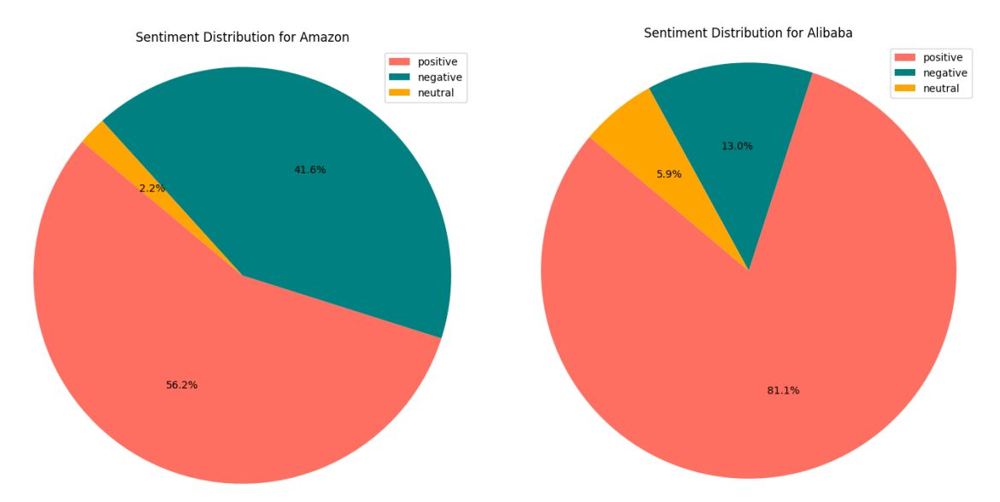
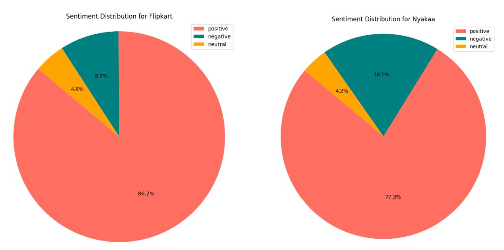
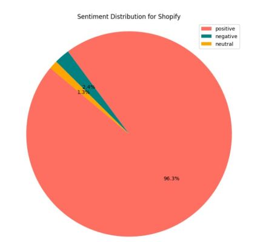

<h1 align="center">Analysing User Experience on E-Commerce Apps using Sentiment Analysis</h1>

Analysing user experience on Alibaba, Amazon, Flipkart, Nyakaa and Shopify app on play store

Image Credit: ClickPost

<h2>Table of Contents</h2>

- [Introduction](#intro)
- [Overview](#overview)
- [Dataset](#data)
- [Sentiment Analysis Technique](#analysis_technique)
- [Exploratory Data Analysis](#eda)
- [Sentiment Analysis Overview](#sentiment_analysis_overview)
- [Key Observations from Sentiment Analysis](#key_observations)

<h2>Introduction</h2>

Sentiment analysis, often referred to as opinion mining, is a natural language processing (NLP) technique used to determine whether textual data conveys positive, negative, or neutral sentiments. It plays a vital role in understanding customer perceptions, especially in the realm of e-commerce, 
where user reviews and feedback are pivotal for improving services, enhancing user experiences, and driving business decisions

<h2>Overview</h2>

This project aims to analyze customer sentiments for five popular e-commerce apps: Amazon, Shopify, Flipkart, Alibaba, and Nykaa. The end objective is to understand user experiences and identify areas for improvement. The sentiment analysis is performed using the VADER (Valence Aware Dictionary and sEntiment Reasoner) model, which is specifically designed for social media texts and is well-suited for analyzing short, informal texts such as user reviews.

<h2>Dataset</h2>

The dataset for this project comprises user reviews from five popular e-commerce platforms: Amazon, Flipkart, Nykaa, Shopify, and Alibaba. These reviews were sourced from various publicly available datasets, and a subset of each was selected to focus the analysis on a manageable volume of data.

The data sources include:
- [Amazon Shopping Reviews](https://www.kaggle.com/datasets/ashishkumarak/amazon-shopping-reviews-daily-updated)
- [Flipkart App Reviews](https://www.kaggle.com/datasets/bwandowando/flipkart-google-store-app-reviews/data)
- [Nykaa App Reviews](https://www.kaggle.com/datasets/nirant/nykaa-app-review-sentiment/data)
- [Shopify App Reviews](https://www.kaggle.com/datasets/usernam3/shopify-app-store)
- [Alibaba Reviews Dataset](https://github.com/Koukotsukan/Alibaba_Reviews_Dataset/tree/main/Dataset)

The selected subsets of the datasets contain the following number of reviews:
- **Amazon**: 2972 reviews
- **Flipkart**: 9906 reviews
- **Nykaa**: 7987 reviews
- **Shopify**: 8909 reviews
- **Alibaba**: 355 reviews

These datasets contain user reviews, which provide valuable insights into customer satisfaction, product experiences, and areas for improvement. You can access the datasets used in this project <a href="https://github.com/Oyebamiji-Micheal/Analysing-User-Experience-on-E-Commerce-Apps-using-NLP/tree/main/datasets">here</a>.

<h2>Sentiment Analysis Technique</h2>

I used VADER to analyze sentiments expressed in user reviews. The following table shows the sentiment distribution for each e-commerce app, based on user comments:

| E-commerce App | Positive | Negative | Neutral | Total Comments | Positive (%) | Negative (%) | Neutral (%) |
|----------------|----------|----------|---------|----------------|--------------|--------------|-------------|
| **Amazon**     | 1671     | 1236     | 65      | 2972           | 56.2%        | 41.6%        | 2.2%        |
| **Flipkart**   | 8540     | 894      | 472     | 9906           | 86.2%        | 9.0%         | 4.8%        |
| **Nykaa**      | 6175     | 1479     | 333     | 7987           | 77.3%        | 18.5%        | 4.2%        |
| **Shopify**    | 8575     | 215      | 119     | 8909           | 96.2%        | 2.4%         | 1.3%        |
| **Alibaba**    | 288      | 46       | 21      | 355            | 81.1%        | 12.9%        | 5.9%        |

 

