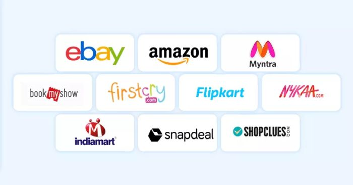

<h1 align="center">Analysing User Experience on E-Commerce Apps using Sentiment Analysis</h1>

Analysing user experience on Alibaba, Amazon, Flipkart, Nyakaa and Shopify app on play store

Image Credit: ClickPost

<h2>Table of Contents</h2>

- [Introduction](#intro)
- [Overview](#overview)
- [Dataset](#data)
- [Sentiment Analysis Technique](#analysis_technique)
- [Amazon User Experience and User Interface](#amazon)
- [Flipkart User Experience and User Interface](#flipkart)
- [Shopify User Experience and User Interface](#shopify)
- [Disclaimer](#disclaimer) 😌

<h2>Introduction</h2>

Sentiment analysis, often referred to as opinion mining, is a natural language processing (NLP) technique used to determine whether textual data conveys positive, negative, or neutral sentiments. It plays a vital role in understanding customer perceptions, especially in the realm of e-commerce, 
where user reviews and feedback are pivotal for improving services, enhancing user experiences, and driving business decisions

<h2>Overview</h2>

This project aims to analyze customer sentiments for five popular e-commerce apps: Amazon, Shopify, Flipkart, Alibaba, and Nykaa. The end objective is to understand user experiences and identify areas for improvement. The sentiment analysis is performed using the VADER (Valence Aware Dictionary and sEntiment Reasoner) model, which is specifically designed for social media texts and is well-suited for analyzing short, informal texts such as user reviews.

<h2>Dataset</h2>

The dataset for this project comprises user reviews from five popular e-commerce platforms: Amazon, Flipkart, Nykaa, Shopify, and Alibaba. These reviews were sourced from various publicly available datasets, and a subset of each was selected to focus the analysis on a manageable volume of data.

The data sources include:
- [Amazon Shopping Reviews](https://www.kaggle.com/datasets/ashishkumarak/amazon-shopping-reviews-daily-updated)
- [Flipkart App Reviews](https://www.kaggle.com/datasets/bwandowando/flipkart-google-store-app-reviews/data)
- [Nykaa App Reviews](https://www.kaggle.com/datasets/nirant/nykaa-app-review-sentiment/data)
- [Shopify App Reviews](https://www.kaggle.com/datasets/usernam3/shopify-app-store)
- [Alibaba Reviews Dataset](https://github.com/Koukotsukan/Alibaba_Reviews_Dataset/tree/main/Dataset)

The selected subsets of the datasets contain the following number of reviews:
- **Amazon**: 2972 reviews
- **Flipkart**: 9906 reviews
- **Nykaa**: 7987 reviews
- **Shopify**: 8909 reviews
- **Alibaba**: 355 reviews

These datasets contain user reviews, which provide valuable insights into customer satisfaction, product experiences, and areas for improvement. You can access the datasets used in this project <a href="https://github.com/Oyebamiji-Micheal/Analysing-User-Experience-on-E-Commerce-Apps-using-NLP/tree/main/datasets">here</a>.

<h2>Sentiment Analysis Technique</h2>

I used VADER to analyze sentiments expressed in user reviews. The following table shows the sentiment distribution for each e-commerce app, based on user comments:

| E-commerce App | Positive | Negative | Neutral | Total Comments | Positive (%) | Negative (%) | Neutral (%) |
|----------------|----------|----------|---------|----------------|--------------|--------------|-------------|
| **Amazon**     | 1671     | 1236     | 65      | 2972           | 56.2%        | 41.6%        | 2.2%        |
| **Flipkart**   | 8540     | 894      | 472     | 9906           | 86.2%        | 9.0%         | 4.8%        |
| **Nykaa**      | 6175     | 1479     | 333     | 7987           | 77.3%        | 18.5%        | 4.2%        |
| **Shopify**    | 8575     | 215      | 119     | 8909           | 96.2%        | 2.4%         | 1.3%        |
| **Alibaba**    | 288      | 46       | 21      | 355            | 81.1%        | 12.9%        | 5.9%        |

 

Based on the analysis, Shopify had the highest percentage of positive sentiments (96.2%), indicating a highly favorable user experience, particularly with its interface. Flipkart also displayed a significant positive response (86.2%), while Alibaba and Nykaa followed with 81.1% and 77.3%,  respectively. Amazon, although still favored by users, had a relatively higher proportion of negative sentiments (41.6%) compared to the others. The number of reviews are not the same so we can't outrightly say an app has the highest number of negative reviews. However, we can infer that Amazon has quite a high number of negative sentiments relative to the total number of reviews on the Amazon app on play store.

<h2>Alibaba User Experience and User Interface</h2>

For the Alibaba e-commerce app, while the positive reviews highlighted product quality and customer service, the negative word cloud reveals issues with the app's functionality and reliability. Words like "refund," "money," and "time" suggest problems with transactions and delays. The 
prominence of "supplier" indicates potential issues with seller reliability or communication. Users seem frustrated with the app's performance, as evidenced by terms like "use" and "still" appearing frequently. Customer service appears to be a pain point, with "inquiry" and "respond" being notable terms, implying difficulties in getting timely support.

<h2>Amazon User Experience and User Interface</h2>

The Amazon app, despite its convenience highlighted in positive reviews, faces criticism in several areas. The negative word cloud prominently features "customer service," suggesting that users are dissatisfied with support. "Delivery" and "order" are also prominent, indicating issues with 
shipping and order fulfillment. The word "experience" is large, implying that many negative reviews focus on overall poor user experiences. Terms like "refund," "cancel," and "return" suggest problems with the post-purchase process. The presence of "app" and "interface" in the negative cloud indicates that some users find the application itself problematic or difficult to navigate.

<h2>Flipkart User Experience and User Interface</h2>

While Flipkart's positive reviews praised its user interface, the negative word cloud paints a different picture. "Interface" and "app" are prominent, suggesting that many users find the app difficult to use or buggy. "Loading" and "slow" indicate performance issues. Customer service 
seems to be a major concern, with "customer" and "service" being large in the cloud. "Delivery" and "order" are also significant, pointing to problems with order fulfillment. The presence of "worst" and "bad" implies strong negative sentiment among some users. "Login" issues are also mentioned, suggesting authentication or account access problems.

<h2>Nyakaa User Experience and User Interface</h2>

Nykaa's negative reviews focus heavily on product and delivery issues. "Product," "order," and "delivery" are among the largest words, indicating problems with what customers receive and how they receive it. "Customer care" is prominent, suggesting difficulties in resolving issues with 
support. "Worst experience" appears as a phrase, implying some users have had particularly bad interactions with the app. "Refund" and "return" are notable, pointing to challenges in the post-purchase process. The repetition of "bad" and "worst" throughout the cloud indicates strong 
negative sentiment among dissatisfied users.

<h2>Shopify User Experience and User Interface</h2>

The Shopify app stands out as the only one in this set with a word cloud showing predominantly positive reviews. This suggests that it generally meets the needs of its users, who are likely to be sellers rather than buyers. The emphasis on words like "easy," "support," and "great" indicates that 
users find the platform user-friendly and well-supported. However, the negative cloud does contain some critical terms, such as "bad," "terrible," and "experience", "bug" and so on which suggests that some users have encountered issues with the app. 

<h2>Disclaimer</h2>

Disclaimer! Disclaimer! Disclaimer!  
All analysis and inference are based on the sentiment analysis of user reviews and may not reflect the actual user experience on the respective e-commerce platforms. The analysis is intended to provide insights and identify potential areas for improvement based on user feedback. I am not responsible for any decisions made based on this analysis. Also, I am not affiliated with any of the e-commerce platforms mentioned in this project. This is all for practice and learning purposes. 

See you in the next one 😉😉